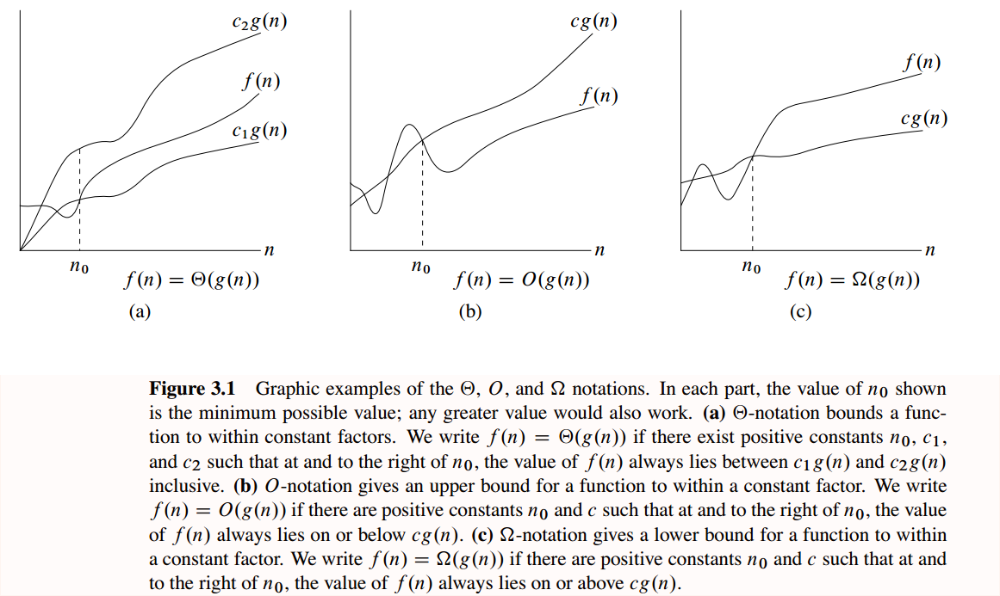

# Introduction To Algorithm
Before there were computers, there were algorithms. But now that there are computers, there are even more algorithms, and algorithms lie at the heart of computing.

## Chapter 1
- [insert sort](src/sort.cpp)
- [merge sort](src/sort.cpp)
- [gcb(辗转相除法，欧几里得算法)](src/buLec01.cpp)

## Chaper 2

- [exist target sum in array](src/ch2.cpp)
- [count_inversion](src/ch2.cpp)


## Time analysis
Theta, Big O, Omega


## How to Run
`mkdir build && cd build`
`cmake -DTEST=1 .. && make -j4 && make install`
`./test_practise`

## Email: caowenlong92@gmail.com

其他用途： 这个包含基本的C++的项目的开发要件，只要稍微对其中的`CMakeLists.txt`进行更改就可以适配到自己的项目中。
项目主要内容包括，
```
.
├── 3rdparty                # 第三方依赖库，主要为gtest
│   ├── gtest
│   └── README.txt
├── CMakeLists.txt          # CMake脚本
├── include                 # 放置头文件
│   ├── buLec01.h
│   ├── ch1.h
│   ├── ch2.h
│   ├── mBinaryTree.h
│   ├── mlist.h
│   ├── practise.h
│   ├── time_helper.h
│   └── util.h
├── src                    # 放置源码文件
│   ├── buLec01.cpp
│   ├── ch2.cpp
│   ├── mBinaryTree.cpp
│   ├── mlist.cpp
│   └── sort.cpp
└── test                   # 测试用例
    ├── test_all.cpp
    ├── test_api.cpp
    ├── test_api.h
    ├── test_buLec01.cpp
    ├── test_ch1.cpp
    ├── test_ch2.cpp
    ├── test_mbtree.cpp
    └── test_mlist.cpp
```
其中只需要对所在文件夹名称和CMakeLists.txt进行相应的改动，就可以重新开辟新的项目。
更多第三方库，可以参考项目[LibsForDev](https://github.com/cwlseu/LibsForDev)